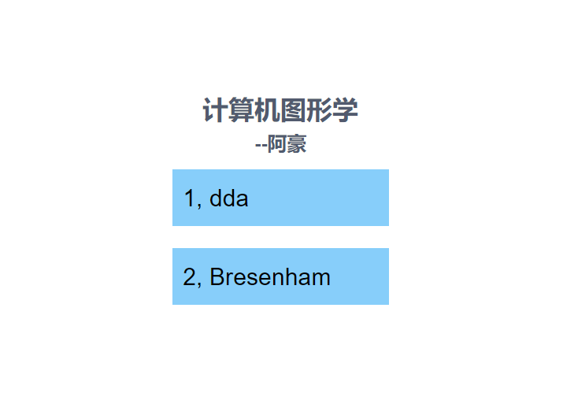
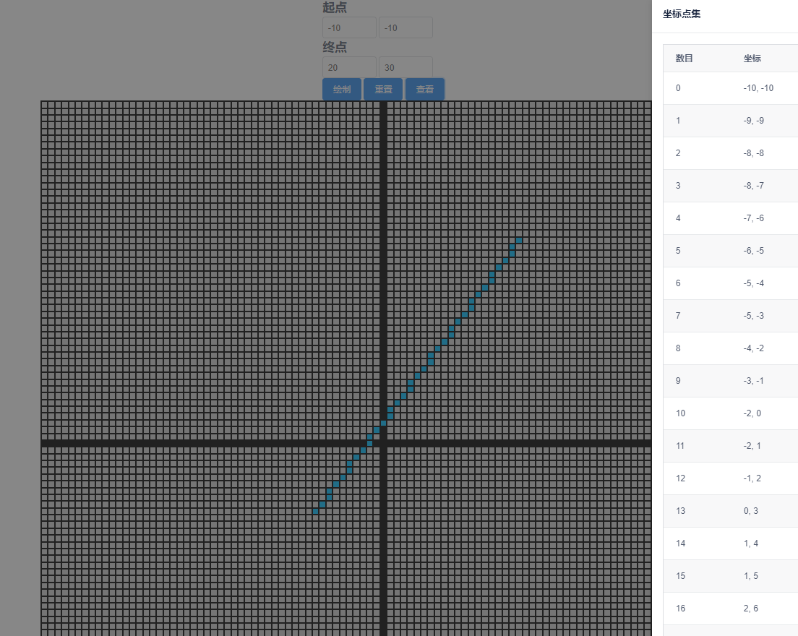
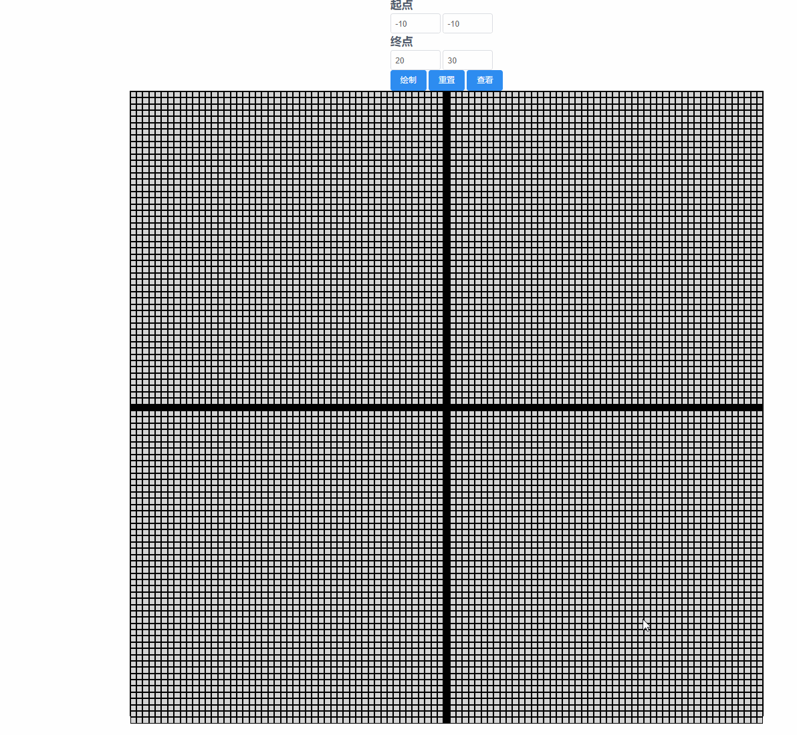

# dda

> A Vue.js project

更新
加入vue router
更新代码结构
可选择展示不同的算法


## dda 算法可视化
效果

动图

可以查看点的生成顺序和点的坐标变化
## Build Setup

``` bash
# install dependencies
npm install

# serve with hot reload at localhost:8080
npm run dev

# build for production with minification
npm run build

# build for production and view the bundle analyzer report
npm run build --report
```

For a detailed explanation on how things work, check out the [guide](http://vuejs-templates.github.io/webpack/) and [docs for vue-loader](http://vuejs.github.io/vue-loader).
